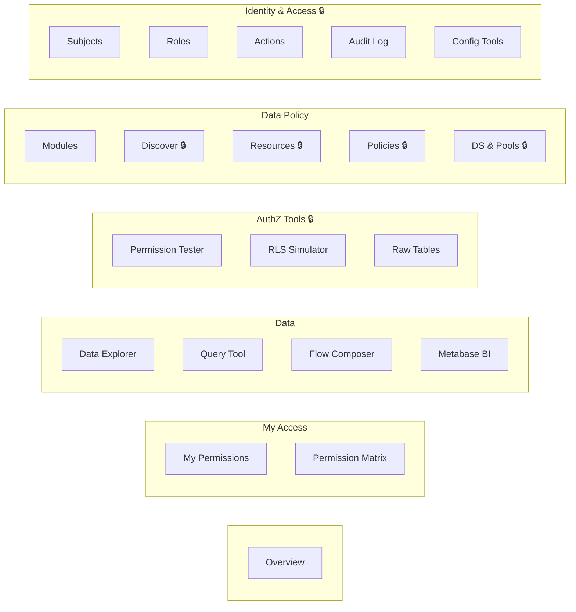
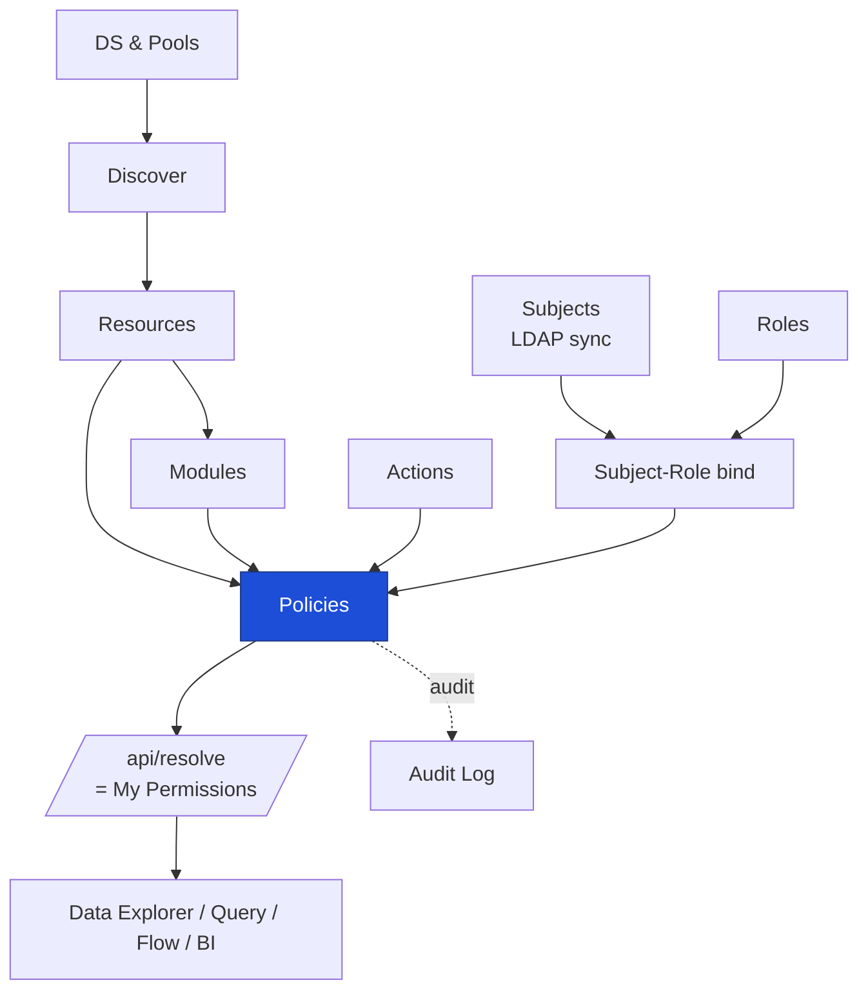
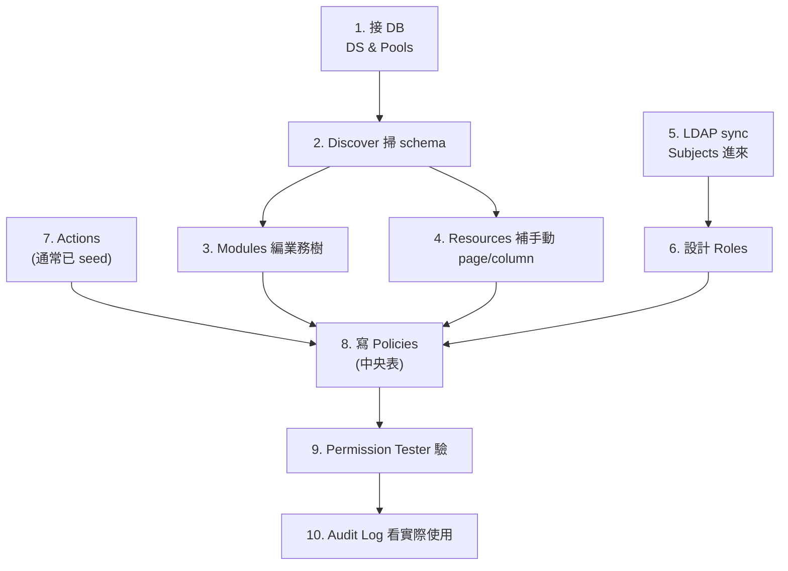
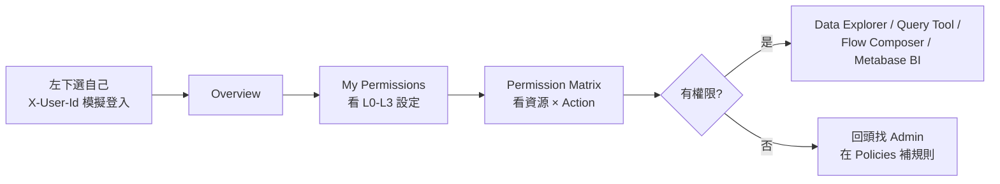

# Phison Data Nexus — Architecture Diagram

> Visual quick-reference for the system architecture.
> For detailed specs see [`phison-data-nexus-architecture-v2.4.md`](phison-data-nexus-architecture-v2.4.md).
> For DB schema see [`er-diagram.md`](er-diagram.md).

## System Overview

```
                                    Phison Data Nexus
 +---------------------------------------------------------------------------+
 |                                                                           |
 |   +-- FRONTEND (React + Vite, port 5173) ----------------------------+   |
 |   |                                                                   |   |
 |   |   User Login (sidebar dropdown)                                   |   |
 |   |       |                                                           |   |
 |   |       v                                                           |   |
 |   |   AuthzContext  -----> POST /api/resolve -----> authz_resolve()   |   |
 |   |       |   (users, config, login/logout)                           |   |
 |   |       |                                                           |   |
 |   |       +---------- Navigation (8 tabs) ---------+                 |   |
 |   |       |                                         |                 |   |
 |   |    [Regular User]                        [Admin Only]             |   |
 |   |    - Overview                            - Permission Tester     |   |
 |   |    - My Permissions                      - RLS Simulator         |   |
 |   |    - Permission Matrix                   - SQL Functions         |   |
 |   |    - Data Explorer (ConfigEngine)        - Raw Tables            |   |
 |   |                                          - Entity Browser (CRUD) |   |
 |   |                                          - Connection Pools      |   |
 |   |                                          - Audit Log             |   |
 |   +-------------------------------------------------------------------+   |
 |       |                                                                   |
 |       | HTTP (X-User-Id / X-User-Groups headers)                          |
 |       v                                                                   |
 |   +-- BACKEND (Express.js + TypeScript, port 3001) ------------------+   |
 |   |                                                                   |   |
 |   |   /api/resolve      --> authz_resolve()    --> L0-L3 config      |   |
 |   |   /api/check        --> authz_check()      --> boolean           |   |
 |   |   /api/filter       --> authz_filter()     --> WHERE clause      |   |
 |   |   /api/matrix       --> role x resource    --> permission grid   |   |
 |   |   /api/config-exec  --> fn_ui_root/page()  --> {config, data}    |   |
 |   |   /api/rls/simulate --> RLS + mask         --> filtered rows     |   |
 |   |   /api/browse/*     --> CRUD + gate        --> entities          |   |
 |   |   /api/pool/*       --> pool management    --> Path C config     |   |
 |   |   /api/datasources  --> data source CRUD   --> connection info   |   |
 |   |                                                                   |   |
 |   +---+--------------------------------------------+------------------+   |
 |       |                                            |                      |
 |       v                                            v                      |
 |   +-- nexus_authz (PostgreSQL) ---+   +-- nexus_data (PostgreSQL) ---+   |
 |   |   Policy Store (SSOT)         |   |   Business Data              |   |
 |   |                               |   |                              |   |
 |   |   authz_subject               |   |   lot_status (21 rows)       |   |
 |   |   authz_role                  |   |   sales_order (14 rows)      |   |
 |   |   authz_role_permission       |   |   wip_inventory              |   |
 |   |   authz_policy                |   |   cp_ft_result               |   |
 |   |   authz_resource              |   |   npi_gate_checklist         |   |
 |   |   authz_action                |   |   reliability_report         |   |
 |   |   authz_audit_log             |   |   rma_record                 |   |
 |   |   authz_ui_page               |   |   price_book                 |   |
 |   |   authz_group_member          |   |                              |   |
 |   |   authz_subject_role          |   +------------------------------+   |
 |   |   authz_db_pool_profile       |       ^                              |
 |   |   authz_pool_credentials      |       | resolveDataSource()          |
 |   |   authz_data_source           +-------+                              |
 |   |                               |                                      |
 |   |   PG Functions:               |                                      |
 |   |   - authz_check()             |                                      |
 |   |   - authz_resolve()           |                                      |
 |   |   - authz_filter()            |                                      |
 |   |   - fn_ui_root()              |                                      |
 |   |   - fn_ui_page()              |                                      |
 |   |   - fn_mask_*()               |                                      |
 |   +-------------------------------+                                      |
 |                                                                           |
 +---------------------------------------------------------------------------+

 External:
 +-- OpenLDAP ----+    +-- pgbouncer (6432) --+    +-- Redis (6379) --+
 | identity-sync  |    | Path C: DB pools     |    | L1 cache        |
 | (LDAP -> DB)   |    | auth_query → authz   |    | (future M4)     |
 +-----------------+    +----------------------+    +-----------------+
```

## Three Access Paths (Enforcement Points)

```
                        authz_role_permission + authz_policy
                                    (SSOT)
                                      |
                   +------------------+------------------+
                   |                  |                  |
                   v                  v                  v
            +-- Path A --+    +-- Path B --+    +-- Path C --+
            | Config-SM  |    | Web + API  |    | DB Direct  |
            | UI         |    | Middleware |    | Connection |
            +------------+    +------------+    +------------+
            |                 |                 |
Resolve     | authz_resolve() | authz_resolve   | authz_sync
            | → L0-L3 config  | _web_acl()      | _db_grants()
            |                 | → page/API ACL  | → PG GRANT
            |                 |                 |
L0 Gate     | fn_ui_root()    | requireRole()   | GRANT on
            | authz_check()   | middleware       | schema/table
            |                 |                 |
L1 RLS      | authz_filter()  | authz_filter()  | PG RLS
            | → WHERE clause  | → WHERE clause  | → policy
            |                 |                 |
L2 Mask     | buildMasked     | column mask     | Column GRANT
            | Select()        | in API response | + mask views
            |                 |                 |
L3 Action   | Approval        | API action      | N/A
            | workflows       | gates           | (readonly)
            +------------+    +------------+    +------------+
            |  Frontend  |    |  Express   |    |  pgbouncer |
            | ConfigEngine|    |  middleware |    |  + PG RLS  |
            +------------+    +------------+    +------------+
```

## Permission Granularity Model (L0-L3)

```
L0: Functional Access (RBAC)
    "Can this role access this module/table?"

    authz_role_permission:
    +--------+---------+----------------------------+--------+
    | role   | action  | resource                   | effect |
    +--------+---------+----------------------------+--------+
    | PE     | read    | module:mrp.lot_tracking     | allow  |
    | PE     | read    | column:lot_status.cost      | deny   |
    | SALES  | read    | module:sales.order_mgmt     | allow  |
    | ADMIN  | read    | module:mrp                  | allow  |
    +--------+---------+----------------------------+--------+

    Hierarchical resolution (recursive CTE):
    column:lot_status.cost
       -> table:lot_status
          -> module:mrp.lot_tracking
             -> module:mrp

    If any ancestor has allow + no explicit deny at child = ALLOW

L1: Data Domain Scope (ABAC + RLS)
    "What ROWS can this user see?"

    authz_policy (L1_data_domain):
    +---------------------+------------------+-------------------------+
    | policy              | subject_condition| rls_expression          |
    +---------------------+------------------+-------------------------+
    | pe_ssd_data_scope   | role=PE,pl=SSD   | product_line = 'SSD'    |
    | sales_tw_region     | role=SALES,r=TW  | region = 'TW'           |
    +---------------------+------------------+-------------------------+

L2: Column Masking (ABAC + Mask Functions)
    "How are sensitive columns transformed?"

    authz_policy (L2_row_column):
    +------------------+---------------------+---------------+
    | policy           | column              | mask_function |
    +------------------+---------------------+---------------+
    | pe_column_masks  | lot_status.cost     | fn_mask_full  |
    | pe_column_masks  | lot_status.unit_price| fn_mask_range|
    +------------------+---------------------+---------------+

    fn_mask_full(12.50)  -> '****'
    fn_mask_range(12.50) -> '10-15'
    fn_mask_hash('John') -> 'a8cfcd74...'

L3: Composite Actions (PBAC)
    "Does this action need multi-step approval?"

    authz_composite_action:
    +----------+----------------+---------------------------+
    | action   | resource       | approval_chain            |
    +----------+----------------+---------------------------+
    | hold     | table:lot_status| Step1: PE, Step2: PM     |
    +----------+----------------+---------------------------+
```

## Metadata-Driven Module Flow (Path A)

```
 1. REGISTER (Admin)              2. AUTHORIZE (Admin)
 +---------------------------+    +---------------------------+
 | INSERT authz_resource     |    | INSERT authz_role_        |
 |   module:mrp.new_feature  |    |   permission (L0)         |
 | INSERT authz_ui_page      |    | INSERT authz_policy       |
 |   page config + columns   |    |   (L1 RLS, L2 masks)     |
 +---------------------------+    +---------------------------+
              |                                |
              v                                v
 3. OPERATE (User)
 +---------------------------------------------------------------+
 |                                                               |
 |   ConfigEngine.tsx                                            |
 |       |                                                       |
 |       v                                                       |
 |   fn_ui_root(user, groups)                                    |
 |       |  authz_check() gate per page                          |
 |       v                                                       |
 |   +-----+  +-----+  +-----+  +-----+  +-----+               |
 |   | Lot |  |Sales|  | NPI |  | QA  |  |Price|  <- cards      |
 |   |Track|  |Order|  |Gate |  |Report| |Book |     (only      |
 |   +--+--+  +-----+  +-----+  +-----+  +-----+     permitted)|
 |      |                                                        |
 |      v  click card                                            |
 |   config-exec POST /{page_id}                                 |
 |       |  1. authz_check(resource_id) -> 403 if denied         |
 |       |  2. buildMaskedSelect() -> L1 RLS + L2 mask           |
 |       |  3. resolveFilterOptions() -> dynamic dropdowns        |
 |       v                                                       |
 |   {config, data, meta}                                        |
 |       |  config.columns -> table header                       |
 |       |  data -> filtered + masked rows                       |
 |       |  meta.columnMasks -> tooltip hints                    |
 |       v                                                       |
 |   DataTable render (sort, filter, drill-down)                 |
 |       |                                                       |
 |       v  click row                                            |
 |   resolveParams(param_mapping, row)                           |
 |       -> navigate to child page (repeat)                      |
 |                                                               |
 +---------------------------------------------------------------+

 Zero frontend code for new modules.
 New module = 3 DB INSERTs -> card appears automatically.
```

## Resource Hierarchy (Current Seed Data)

```
module:mrp                         MRP System
 +-- module:mrp.lot_tracking        Lot Tracking / WIP
 |    +-- table:lot_status           Lot Status Table
 |    |    +-- column:lot_status.unit_price
 |    |    +-- column:lot_status.cost
 |    |    +-- column:lot_status.customer
 |    +-- table:wip_inventory        WIP Inventory
 +-- module:mrp.yield_analysis      Yield Analysis
 |    +-- table:cp_ft_result         CP/FT Test Results
 +-- module:mrp.npi                 NPI Gate Review
      +-- table:npi_gate_checklist   NPI Gate Checklist

module:quality                     Quality System
 +-- module:quality.reliability     Reliability Testing
 |    +-- table:reliability_report   Reliability Reports
 +-- module:quality.rma             RMA Management
 |    +-- table:rma_record           RMA Records
 +-- module:quality.failure_analysis Failure Analysis

module:sales                       Sales System
 +-- module:sales.order_mgmt       Order Management
 |    +-- table:sales_order          Sales Orders
 +-- module:sales.pricing           Pricing Management
 |    +-- table:price_book           Price Book
 |         +-- column:price_book.margin
 +-- module:sales.customer          Customer Management

module:engineering                 Engineering System
 +-- module:engineering.firmware    Firmware Repository
 +-- module:engineering.test_program Test Programs
 +-- module:engineering.design_data Design Data (restricted)

module:analytics                   Analytics & BI
 +-- module:analytics.dashboard     BI Dashboards
 +-- module:analytics.reports       Reports
```

## Role-Based Access Matrix (Column Sensitivity)

```
                unit_price   cost      customer   margin
                (lot)        (lot)     (lot)      (price_book)
 +-----------+  ----------   --------  ---------  -----------
 | PE        |  DENY         DENY      visible    DENY
 | PM        |  visible      visible   visible    visible
 | QA        |  DENY         DENY      visible    DENY
 | SALES     |  visible      DENY      visible    DENY
 | FAE       |  visible      DENY      visible    DENY
 | FW / RD   |  DENY         DENY      visible    DENY
 | OP        |  DENY         DENY      DENY       DENY
 | BI        |  DENY         DENY      DENY       DENY
 | FINANCE   |  DENY         DENY      DENY       visible
 | VP        |  visible      visible   visible    visible
 | ADMIN     |  visible      visible   visible    visible
 +-----------+  ----------   --------  ---------  -----------

 visible = hierarchical allow from parent module
 DENY    = explicit deny in authz_role_permission
```

## Infrastructure Stack

```
 +-- Docker Compose ------------------------------------------+
 |                                                            |
 |  postgres:16    pgbouncer:1.22    redis:7     openldap     |
 |  port 5432      port 6432         port 6379   port 389     |
 |  nexus_authz    auth_query →      (future     seed LDIF    |
 |  nexus_data     nexus_authz       M4 cache)   for POC      |
 |                                                            |
 +------------------------------------------------------------+

 +-- Application Layer --------------------------------------+
 |                                                            |
 |  authz-api        identity-sync      authz-dashboard       |
 |  (Express.js)     (LDAP daemon)      (React + Vite)        |
 |  port 3001        no HTTP port       port 5173             |
 |  TypeScript        TypeScript        TypeScript            |
 |                                                            |
 +------------------------------------------------------------+

 Migrations: V001-V024 (sequential SQL, Flyway-compatible)
 Seed: dev-seed.sql (authz data) + ui-config-seed.sql (UI pages)
```

---

## Sidebar & Onboarding Flow

> Source of truth for sidebar groups: `apps/authz-dashboard/src/components/Layout.tsx` (`navGroups`).
> Tabs marked 🔒 are `adminOnly` (filtered at `Layout.tsx:161` against `isAdmin` from `AuthzContext`).

### Sidebar Groups



### Data Dependency (who must exist before what)



> **Policies 是中央表**：把 Subject/Role × Action × Resource 黏在一起。沒它，Data 區所有東西都查不到。

### Admin Bootstrap Sequence



### End-User Flow



### Two-Actor Timeline (誰先做什麼)

```mermaid
sequenceDiagram
  autonumber
  participant A as Admin
  participant Sys as Data Nexus
  participant U as End User

  A->>Sys: DS &amp; Pools 接 DB
  A->>Sys: Discover 掃 schema → Resources
  A->>Sys: Modules 編業務樹
  par Identity 線
    A->>Sys: LDAP sync → Subjects
    A->>Sys: 定 Roles / Actions
  end
  A->>Sys: 寫 Policies (中央黏合)
  A->>Sys: Permission Tester 驗
  Note over A,Sys: ✅ 全綠後通知使用者開工
  U->>Sys: 選自己登入
  U->>Sys: 看 My Permissions
  alt 有權限
    U->>Sys: 進 Data Explorer / Query / Flow / BI
  else 沒權限
    U->>A: 回報缺哪條 Policy
    A->>Sys: 在 Policies 補
  end
  Sys-->>A: Audit Log 顯示實際使用
```

