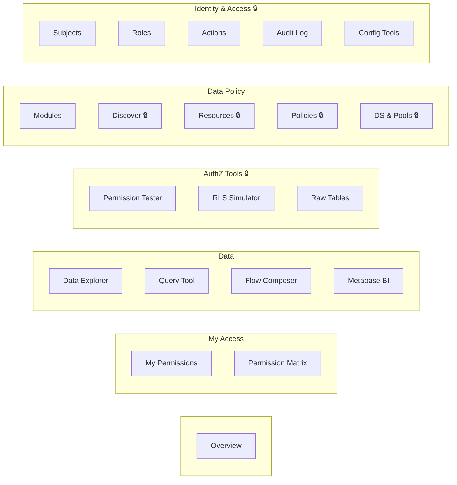
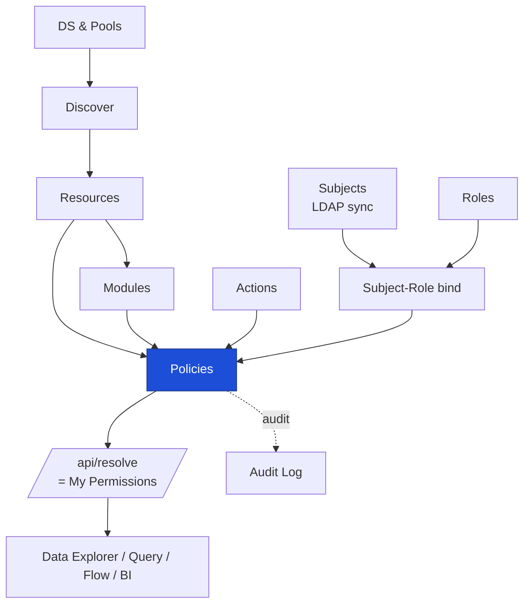
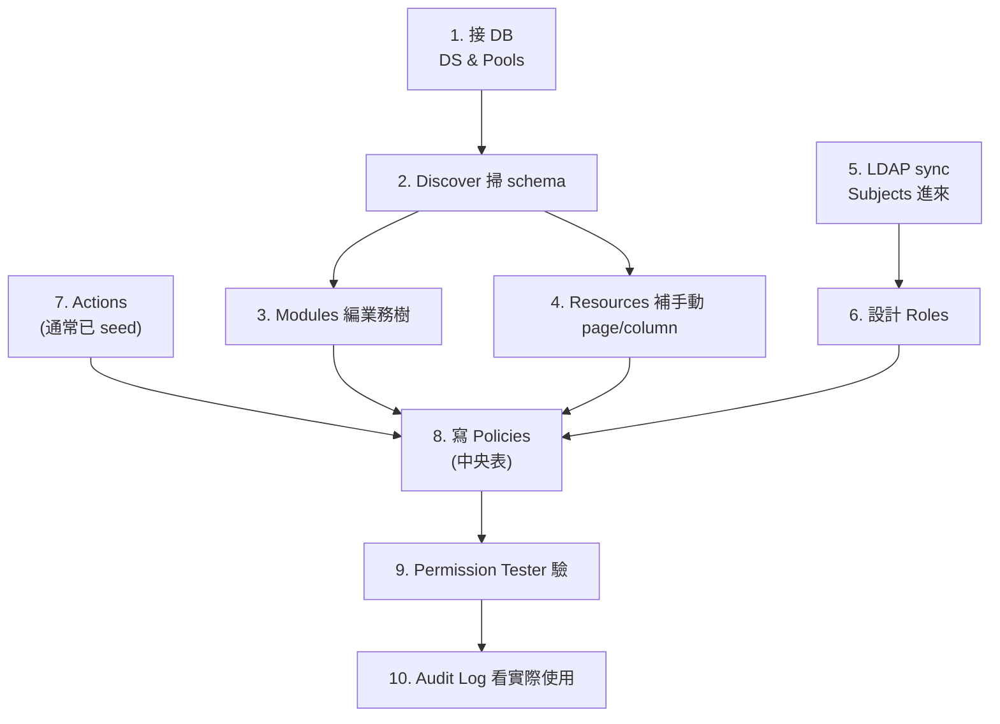
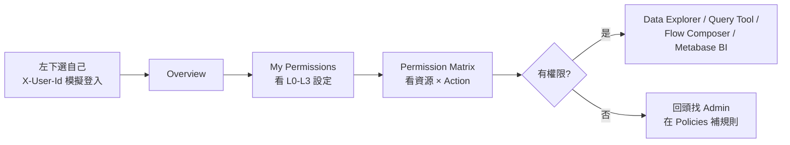

# Phison Data Nexus — Architecture Diagram

> Visual quick-reference for the system architecture.
> For detailed specs see [`phison-data-nexus-architecture-v2.4.md`](phison-data-nexus-architecture-v2.4.md).
> For DB schema see [`er-diagram.md`](er-diagram.md).

> **Reading order:** "Current Snapshot" below is the up-to-date top-level view (V070+, AI dogfood, NPI vertical, workflow primitive). Sections from "System Overview (V020-era baseline)" downward are the original baseline diagrams — still valid for the AuthZ core (three paths, L0-L3, Path A flow, sidebar, bootstrap), but they predate `resource_ancestors` deny-walk, AI audit columns, eval capture, lifecycle/workflow primitive, and the NPI vertical.

---

## Current Snapshot (2026-04-28, V070+)

### A. System Overview

```
                       Phison Data Nexus
+-------------------------------------------------------------------------+
|  FRONTEND  apps/authz-dashboard  (React + Vite, port 13173)             |
|  ----------------------------------------------------------------       |
|   AuthzContext         GET /api/resolve         L0-L3 + is_sysadmin     |
|   RenderTokensContext  GET /api/ui/render-tokens  ICON/COLOR (V053)     |
|                                                                         |
|   Tabs:                                                                 |
|     My Access:   Overview · Resolve · Matrix                            |
|     Data:        DataQuery · Dag (Flow Composer) · Metabase             |
|     AuthZ Tools: Check · RLS · Tables                  (admin)          |
|     Data Policy: Modules · Discover · Resources · Policies · DS/Pool    |
|     Identity:    Subjects · Roles · Actions · Audit · ConfigTools       |
|     Vertical:    NpiGateConsole          <-- V078 first vertical tab    |
|     AI:          AIProviders · AuthorPanelAIAssist (in DataQuery)       |
+--------------------------------+----------------------------------------+
                                 | HTTP X-User-Id / X-User-Groups
                                 v
+-------------------------------------------------------------------------+
|  BACKEND  services/authz-api  (Express + TS, port 13001)                |
|  ----------------------------------------------------------------       |
|  routes/        resolve · check · filter · matrix                       |
|                 config-exec     (Path A render engine)                  |
|                 rls-simulate · browse-{read,admin}                      |
|                 datasource · pool · discover                            |
|                 dag · data-query · oracle-exec                          |
|                 modules · ui                                            |
|                 ai-assist · ai-provider     <-- AI dogfood              |
|                 workflow                    <-- V075 workflow primitive |
|  lib/           policy-evaluator · policy-cache · policy-events         |
|                 discovery-rule-engine                                   |
|                 ai-call · ai-context · admin-audit · crypto             |
|                 dag-validate · masked-query · rewriter/                 |
|                 schema-to-ui · function-metadata · remote-sync          |
+----+--------------------------------------------+----------------------+
     |                                            |
     v                                            v
+-- nexus_authz (PG 16, SSOT) --+        +-- Business data sources -----+
| authz_subject/role/...        |        | nexus_data (local PG)        |
| authz_role_permission         |        |   lot_status / sales_order / |
| authz_policy                  |        |   wip_inventory /            |
| authz_resource                |        |   cp_ft_result /             |
|   + attributes.data_source_id |        |   npi_gate_checklist +       |
|   + entity_kind (V073)        |        |   V076-V078 NPI seed         |
| authz_data_source             |        |                              |
|   + default_l0_policy (V059)  |        | Onboarded externals:         |
| authz_discovery_rule (V061)   |        |   tiptop (pg_k8) ERP         |
|   + effect deny/allow         |        |   Oracle 19c CDC (designed,  |
| authz_ui_page                 |        |   not yet implemented)       |
|   + snapshot_data (V054)      |        +------------------------------+
| authz_ui_render_token (V053)              ^
| authz_audit_log                           | resolveDataSource(resource)
|   + AI cols V049/V065                     |
|     (actor_type / agent_id /              |
|      model_id / consent_given)            |
| authz_ai_provider     (V052)              |
| authz_ai_usage        (V052)              |
| authz_eval_case       (V071)  AI eval capture
| authz_entity_kind     (V073)  Tier B semantic class
| authz_lifecycle_definition  (V074) state-machine spec
| authz_lifecycle_instance    (V074) runtime state
| authz_workflow_request      (V075) submitted request
| authz_workflow_approval_record (V075) chain step result
|                               |
| PG functions                  |
|   authz_resolve / authz_check / authz_filter                |
|   authz_sync_db_grants  (Path C, symmetric REVOKE V063)     |
|   fn_ui_root / fn_ui_page / fn_mask_*                       |
|   resource_ancestors  (mat view, V037; deny-walk by V070)   |
+-------------------------------+

External / side:
  TimescaleDB hypertable  (V030)   audit log compression + 7y retention (V056)
  pgaudit Path C ingest   (V057/V058)
  pgbouncer (port 16432)           Path C auth_query → nexus_authz
  Redis 7 (port 16379)             cache slot (M4 上線正式啟用)
  OpenLDAP (port 389)              identity-sync → authz_group_member
```

### B. Path A request flow (most common)

```
[User clicks card]
      |
      v
ConfigEngine.tsx                          (Path A metadata-driven UI)
      |
      | POST /api/config-exec/:page_id   body={params}
      v
+-- routes/config-exec.ts ----------------------------------------+
|  step 1: authz_check(user, action, resource)                    |
|          |- V066 SYSADMIN short-circuit  -> ALLOW               |
|          |- resource_ancestors deny-walk (V070)                 |
|          |- V064 explicit deny in authz_policy?                 |
|          \- datasource.default_l0_policy: deny / allow inverted |
|          -> 403 if denied                                       |
|                                                                 |
|  step 2: fn_ui_page(page_id, user) -> {columns, filters, sql}   |
|                                                                 |
|  step 3: buildMaskedSelect()                                    |
|          |- L1 RLS:   authz_filter() -> WHERE clause            |
|          \- L2 mask:  fn_mask_full / range / hash               |
|                                                                 |
|  step 3a (V054 snapshot): cached page -> return cached rows     |
|                                                                 |
|  step 4: resolveDataSource(resource) -> nexus_data / tiptop     |
|          -> execute SELECT                                      |
|                                                                 |
|  step 5: audit insert (actor_type='human', consent='implicit')  |
+-----------------------------------------------------------------+
      |
      v
{config, data, meta} -> DataTable render -> click row -> child page
```

### C. AI dogfood loop (AuthorPanelAIAssist + eval capture)

```
   AuthorPanel  (DataQueryTab)
         |
         | "draft / refine / explain"
         v
+-- routes/ai-assist.ts -------------------------------------+
|  requireRole('ADMIN','AUTHZ_ADMIN')                        |
|                                                            |
|  lib/ai-context.ts                                         |
|     \- per-row authz_check filter -> max 50 tables x 30 cols
|        (Constitution §9.2: AI-visible schema is gated by   |
|        the calling user's permissions)                     |
|                                                            |
|  lib/ai-call.ts                                            |
|     |- provider resolve by purpose_tags='sql_authoring'    |
|     |- AES-256 decrypt API key                             |
|     |- OpenAI-compatible chat/completions                  |
|     |- destructive regex guard:                            |
|     |   DROP / TRUNCATE / GRANT / REVOKE /                 |
|     |   COPY / DELETE / UPDATE / INSERT                    |
|     \- -> authz_ai_usage ledger (SHA-256 prompt hash)      |
|                                                            |
|  lib/admin-audit.ts                                        |
|     \- logAdminAction(actor_type='ai_agent',               |
|                       agent_id, model_id,                  |
|                       consent_given='human_explicit')      |
+------------------------------------------------------------+
         |
         | response { sql, model_id, latency, cost, usage_id }
         v
   AuthorPanelAIAssist renders SQL  ->  fills textarea
                                        (NEVER auto-deploy, §9.3)
         |
         v   user clicks Deploy -> window.confirm -> normal Path B
         |
         |   user reviews answer  ->  clicks 👍 / 👎
         v
   POST /api/ai-assist/eval-mark { usage_id, verdict }
         |- ownership check: authz_ai_usage.called_by = subject
         |- INSERT authz_eval_case(prompt_text, response_text,
         |                          verdict, ds_id, model_id)   <- V071
         \- audit AI_ASSIST_EVAL_MARK
                                                                  ^
                                                                  |
                                                  Eval set grows by use,
                                                  not by interview.
                                                  (Constitution §9.9)
```

### D. NPI vertical: workflow + lifecycle (V073-V078)

```
  authz_resource (entity_kind='npi_material')   <- V073 + V076 seed
         |
         | governed by
         v
  authz_lifecycle_definition                                    <- V074
     'npi_gate_lifecycle'  states: NPI_G0..NPI_G4
                           transitions: G0->G1, G1->G2, G2->G3, G3->G4
         |
         | one instance per material
         v
  authz_lifecycle_instance.current_state = 'NPI_G2'             <- V074

  Advance G2 -> G3 is a composite_action (V003 spec, V075 runtime):
  -----------------------------------------------------------------
         |
         | requester submits
         v
  +-- routes/workflow.ts ---------------------------------------+
  |  authz_check(requester, target_action, target_resource)    |
  |     -> 403 if no permission                                |
  |  INSERT authz_workflow_request(status='pending')           |  <- V075
  +------------------------------------------------------------+
         |
         | each approver in approval_chain leaves a record
         v
  authz_workflow_approval_record (one per chain step)          <- V075
         |
         | on final approve
         v
  UPDATE authz_lifecycle_instance.current_state = 'NPI_G3'
  audit insert (actor_type='human', consent='human_explicit')
         |
         v
  NpiGateConsoleTab renders updated state                       <- V078
```

> **Hot-path note:** lifecycle / workflow / entity_kind tables are **not** read inside `authz_check` or `authz_resolve`. Permission still flows through `authz_role_permission` + `authz_policy`; lifecycle gating sits on top in the workflow layer.

---

## System Overview (V020-era baseline)

```
                                    Phison Data Nexus
 +---------------------------------------------------------------------------+
 |                                                                           |
 |   +-- FRONTEND (React + Vite, port 5173) ----------------------------+   |
 |   |                                                                   |   |
 |   |   User Login (sidebar dropdown)                                   |   |
 |   |       |                                                           |   |
 |   |       v                                                           |   |
 |   |   AuthzContext  -----> POST /api/resolve -----> authz_resolve()   |   |
 |   |       |   (users, config, login/logout)                           |   |
 |   |       |                                                           |   |
 |   |       +---------- Navigation (8 tabs) ---------+                 |   |
 |   |       |                                         |                 |   |
 |   |    [Regular User]                        [Admin Only]             |   |
 |   |    - Overview                            - Permission Tester     |   |
 |   |    - My Permissions                      - RLS Simulator         |   |
 |   |    - Permission Matrix                   - SQL Functions         |   |
 |   |    - Data Explorer (ConfigEngine)        - Raw Tables            |   |
 |   |                                          - Entity Browser (CRUD) |   |
 |   |                                          - Connection Pools      |   |
 |   |                                          - Audit Log             |   |
 |   +-------------------------------------------------------------------+   |
 |       |                                                                   |
 |       | HTTP (X-User-Id / X-User-Groups headers)                          |
 |       v                                                                   |
 |   +-- BACKEND (Express.js + TypeScript, port 3001) ------------------+   |
 |   |                                                                   |   |
 |   |   /api/resolve      --> authz_resolve()    --> L0-L3 config      |   |
 |   |   /api/check        --> authz_check()      --> boolean           |   |
 |   |   /api/filter       --> authz_filter()     --> WHERE clause      |   |
 |   |   /api/matrix       --> role x resource    --> permission grid   |   |
 |   |   /api/config-exec  --> fn_ui_root/page()  --> {config, data}    |   |
 |   |   /api/rls/simulate --> RLS + mask         --> filtered rows     |   |
 |   |   /api/browse/*     --> CRUD + gate        --> entities          |   |
 |   |   /api/pool/*       --> pool management    --> Path C config     |   |
 |   |   /api/datasources  --> data source CRUD   --> connection info   |   |
 |   |                                                                   |   |
 |   +---+--------------------------------------------+------------------+   |
 |       |                                            |                      |
 |       v                                            v                      |
 |   +-- nexus_authz (PostgreSQL) ---+   +-- nexus_data (PostgreSQL) ---+   |
 |   |   Policy Store (SSOT)         |   |   Business Data              |   |
 |   |                               |   |                              |   |
 |   |   authz_subject               |   |   lot_status (21 rows)       |   |
 |   |   authz_role                  |   |   sales_order (14 rows)      |   |
 |   |   authz_role_permission       |   |   wip_inventory              |   |
 |   |   authz_policy                |   |   cp_ft_result               |   |
 |   |   authz_resource              |   |   npi_gate_checklist         |   |
 |   |   authz_action                |   |   reliability_report         |   |
 |   |   authz_audit_log             |   |   rma_record                 |   |
 |   |   authz_ui_page               |   |   price_book                 |   |
 |   |   authz_group_member          |   |                              |   |
 |   |   authz_subject_role          |   +------------------------------+   |
 |   |   authz_db_pool_profile       |       ^                              |
 |   |   authz_pool_credentials      |       | resolveDataSource()          |
 |   |   authz_data_source           +-------+                              |
 |   |                               |                                      |
 |   |   PG Functions:               |                                      |
 |   |   - authz_check()             |                                      |
 |   |   - authz_resolve()           |                                      |
 |   |   - authz_filter()            |                                      |
 |   |   - fn_ui_root()              |                                      |
 |   |   - fn_ui_page()              |                                      |
 |   |   - fn_mask_*()               |                                      |
 |   +-------------------------------+                                      |
 |                                                                           |
 +---------------------------------------------------------------------------+

 External:
 +-- OpenLDAP ----+    +-- pgbouncer (6432) --+    +-- Redis (6379) --+
 | identity-sync  |    | Path C: DB pools     |    | L1 cache        |
 | (LDAP -> DB)   |    | auth_query → authz   |    | (future M4)     |
 +-----------------+    +----------------------+    +-----------------+
```

## Three Access Paths (Enforcement Points)

```
                        authz_role_permission + authz_policy
                                    (SSOT)
                                      |
                   +------------------+------------------+
                   |                  |                  |
                   v                  v                  v
            +-- Path A --+    +-- Path B --+    +-- Path C --+
            | Config-SM  |    | Web + API  |    | DB Direct  |
            | UI         |    | Middleware |    | Connection |
            +------------+    +------------+    +------------+
            |                 |                 |
Resolve     | authz_resolve() | authz_resolve   | authz_sync
            | → L0-L3 config  | _web_acl()      | _db_grants()
            |                 | → page/API ACL  | → PG GRANT
            |                 |                 |
L0 Gate     | fn_ui_root()    | requireRole()   | GRANT on
            | authz_check()   | middleware       | schema/table
            |                 |                 |
L1 RLS      | authz_filter()  | authz_filter()  | PG RLS
            | → WHERE clause  | → WHERE clause  | → policy
            |                 |                 |
L2 Mask     | buildMasked     | column mask     | Column GRANT
            | Select()        | in API response | + mask views
            |                 |                 |
L3 Action   | Approval        | API action      | N/A
            | workflows       | gates           | (readonly)
            +------------+    +------------+    +------------+
            |  Frontend  |    |  Express   |    |  pgbouncer |
            | ConfigEngine|    |  middleware |    |  + PG RLS  |
            +------------+    +------------+    +------------+
```

## Permission Granularity Model (L0-L3)

```
L0: Functional Access (RBAC)
    "Can this role access this module/table?"

    authz_role_permission:
    +--------+---------+----------------------------+--------+
    | role   | action  | resource                   | effect |
    +--------+---------+----------------------------+--------+
    | PE     | read    | module:mrp.lot_tracking     | allow  |
    | PE     | read    | column:lot_status.cost      | deny   |
    | SALES  | read    | module:sales.order_mgmt     | allow  |
    | ADMIN  | read    | module:mrp                  | allow  |
    +--------+---------+----------------------------+--------+

    Hierarchical resolution (recursive CTE):
    column:lot_status.cost
       -> table:lot_status
          -> module:mrp.lot_tracking
             -> module:mrp

    If any ancestor has allow + no explicit deny at child = ALLOW

    Default-allow inversion (Phase 1 — V059/V060/V064):

      authz_data_source.default_l0_policy: ENUM('deny' | 'allow')
                              |
                  +-----------+-----------+
                  | 'deny' (legacy)        'allow' (inverted)
                  v                        v
       authz_check() returns:    authz_check() returns:
       explicit allow            TRUE  UNLESS one of:
         AND NOT explicit deny     - authz_role_permission(effect='deny') [V060]
                                   - authz_policy(effect='deny',           [V064]
                                       status='active',
                                       granularity ∈ {L0_functional,
                                                      L1_data_domain})

    Resource → datasource binding: authz_resource.attributes->>'data_source_id'.
    Resources without a data_source_id fall back to legacy semantics regardless
    of any datasource flag.

    AC-1.5 approval loop:
      Discover engine emits authz_discovery_rule(effect='deny') match
        -> INSERT authz_policy(status='pending_review', effect='deny')
        -> operator approves via PATCH /api/discover/suggestions/:id
        -> status flips 'active'
        -> V064 widened deny check enforces on next authz_check().

    Path A (Config-SM cache): NOT inverted at the API layer. Frontend reads
    default_l0_policy directly and renders accordingly (plan §3.2). Path B
    enforces via authz_check (inverted). Path C enforces via PG GRANT +
    pg_default_acl, which authz_sync_db_grants() (V063) maintains symmetric
    REVOKE for AC-1.7 rollback.

L1: Data Domain Scope (ABAC + RLS)
    "What ROWS can this user see?"

    authz_policy (L1_data_domain):
    +---------------------+------------------+-------------------------+
    | policy              | subject_condition| rls_expression          |
    +---------------------+------------------+-------------------------+
    | pe_ssd_data_scope   | role=PE,pl=SSD   | product_line = 'SSD'    |
    | sales_tw_region     | role=SALES,r=TW  | region = 'TW'           |
    +---------------------+------------------+-------------------------+

L2: Column Masking (ABAC + Mask Functions)
    "How are sensitive columns transformed?"

    authz_policy (L2_row_column):
    +------------------+---------------------+---------------+
    | policy           | column              | mask_function |
    +------------------+---------------------+---------------+
    | pe_column_masks  | lot_status.cost     | fn_mask_full  |
    | pe_column_masks  | lot_status.unit_price| fn_mask_range|
    +------------------+---------------------+---------------+

    fn_mask_full(12.50)  -> '****'
    fn_mask_range(12.50) -> '10-15'
    fn_mask_hash('John') -> 'a8cfcd74...'

L3: Composite Actions (PBAC)
    "Does this action need multi-step approval?"

    authz_composite_action:
    +----------+----------------+---------------------------+
    | action   | resource       | approval_chain            |
    +----------+----------------+---------------------------+
    | hold     | table:lot_status| Step1: PE, Step2: PM     |
    +----------+----------------+---------------------------+
```

## Metadata-Driven Module Flow (Path A)

```
 1. REGISTER (Admin)              2. AUTHORIZE (Admin)
 +---------------------------+    +---------------------------+
 | INSERT authz_resource     |    | INSERT authz_role_        |
 |   module:mrp.new_feature  |    |   permission (L0)         |
 | INSERT authz_ui_page      |    | INSERT authz_policy       |
 |   page config + columns   |    |   (L1 RLS, L2 masks)     |
 +---------------------------+    +---------------------------+
              |                                |
              v                                v
 3. OPERATE (User)
 +---------------------------------------------------------------+
 |                                                               |
 |   ConfigEngine.tsx                                            |
 |       |                                                       |
 |       v                                                       |
 |   fn_ui_root(user, groups)                                    |
 |       |  authz_check() gate per page                          |
 |       v                                                       |
 |   +-----+  +-----+  +-----+  +-----+  +-----+               |
 |   | Lot |  |Sales|  | NPI |  | QA  |  |Price|  <- cards      |
 |   |Track|  |Order|  |Gate |  |Report| |Book |     (only      |
 |   +--+--+  +-----+  +-----+  +-----+  +-----+     permitted)|
 |      |                                                        |
 |      v  click card                                            |
 |   config-exec POST /{page_id}                                 |
 |       |  1. authz_check(resource_id) -> 403 if denied         |
 |       |  2. buildMaskedSelect() -> L1 RLS + L2 mask           |
 |       |  3. resolveFilterOptions() -> dynamic dropdowns        |
 |       v                                                       |
 |   {config, data, meta}                                        |
 |       |  config.columns -> table header                       |
 |       |  data -> filtered + masked rows                       |
 |       |  meta.columnMasks -> tooltip hints                    |
 |       v                                                       |
 |   DataTable render (sort, filter, drill-down)                 |
 |       |                                                       |
 |       v  click row                                            |
 |   resolveParams(param_mapping, row)                           |
 |       -> navigate to child page (repeat)                      |
 |                                                               |
 +---------------------------------------------------------------+

 Zero frontend code for new modules.
 New module = 3 DB INSERTs -> card appears automatically.
```

## Resource Hierarchy (Current Seed Data)

```
module:mrp                         MRP System
 +-- module:mrp.lot_tracking        Lot Tracking / WIP
 |    +-- table:lot_status           Lot Status Table
 |    |    +-- column:lot_status.unit_price
 |    |    +-- column:lot_status.cost
 |    |    +-- column:lot_status.customer
 |    +-- table:wip_inventory        WIP Inventory
 +-- module:mrp.yield_analysis      Yield Analysis
 |    +-- table:cp_ft_result         CP/FT Test Results
 +-- module:mrp.npi                 NPI Gate Review
      +-- table:npi_gate_checklist   NPI Gate Checklist

module:quality                     Quality System
 +-- module:quality.reliability     Reliability Testing
 |    +-- table:reliability_report   Reliability Reports
 +-- module:quality.rma             RMA Management
 |    +-- table:rma_record           RMA Records
 +-- module:quality.failure_analysis Failure Analysis

module:sales                       Sales System
 +-- module:sales.order_mgmt       Order Management
 |    +-- table:sales_order          Sales Orders
 +-- module:sales.pricing           Pricing Management
 |    +-- table:price_book           Price Book
 |         +-- column:price_book.margin
 +-- module:sales.customer          Customer Management

module:engineering                 Engineering System
 +-- module:engineering.firmware    Firmware Repository
 +-- module:engineering.test_program Test Programs
 +-- module:engineering.design_data Design Data (restricted)

module:analytics                   Analytics & BI
 +-- module:analytics.dashboard     BI Dashboards
 +-- module:analytics.reports       Reports
```

## Role-Based Access Matrix (Column Sensitivity)

```
                unit_price   cost      customer   margin
                (lot)        (lot)     (lot)      (price_book)
 +-----------+  ----------   --------  ---------  -----------
 | PE        |  DENY         DENY      visible    DENY
 | PM        |  visible      visible   visible    visible
 | QA        |  DENY         DENY      visible    DENY
 | SALES     |  visible      DENY      visible    DENY
 | FAE       |  visible      DENY      visible    DENY
 | FW / RD   |  DENY         DENY      visible    DENY
 | OP        |  DENY         DENY      DENY       DENY
 | BI        |  DENY         DENY      DENY       DENY
 | FINANCE   |  DENY         DENY      DENY       visible
 | VP        |  visible      visible   visible    visible
 | ADMIN     |  visible      visible   visible    visible
 +-----------+  ----------   --------  ---------  -----------

 visible = hierarchical allow from parent module
 DENY    = explicit deny in authz_role_permission
```

## Infrastructure Stack

```
 +-- Docker Compose ------------------------------------------+
 |                                                            |
 |  postgres:16    pgbouncer:1.22    redis:7     openldap     |
 |  port 5432      port 6432         port 6379   port 389     |
 |  nexus_authz    auth_query →      (future     seed LDIF    |
 |  nexus_data     nexus_authz       M4 cache)   for POC      |
 |                                                            |
 +------------------------------------------------------------+

 +-- Application Layer --------------------------------------+
 |                                                            |
 |  authz-api        identity-sync      authz-dashboard       |
 |  (Express.js)     (LDAP daemon)      (React + Vite)        |
 |  port 3001        no HTTP port       port 5173             |
 |  TypeScript        TypeScript        TypeScript            |
 |                                                            |
 +------------------------------------------------------------+

 Migrations: V001-V024 (sequential SQL, Flyway-compatible)
 Seed: dev-seed.sql (authz data) + ui-config-seed.sql (UI pages)
```

---

## Sidebar & Onboarding Flow

> Source of truth for sidebar groups: `apps/authz-dashboard/src/components/Layout.tsx` (`navGroups`).
> Tabs marked 🔒 are `adminOnly` (filtered at `Layout.tsx:161` against `isAdmin` from `AuthzContext`).

### Sidebar Groups



### Data Dependency (who must exist before what)



> **Policies 是中央表**：把 Subject/Role × Action × Resource 黏在一起。沒它，Data 區所有東西都查不到。

### Admin Bootstrap Sequence



### End-User Flow



### Two-Actor Timeline (誰先做什麼)

```mermaid
sequenceDiagram
  autonumber
  participant A as Admin
  participant Sys as Data Nexus
  participant U as End User

  A->>Sys: DS &amp; Pools 接 DB
  A->>Sys: Discover 掃 schema → Resources
  A->>Sys: Modules 編業務樹
  par Identity 線
    A->>Sys: LDAP sync → Subjects
    A->>Sys: 定 Roles / Actions
  end
  A->>Sys: 寫 Policies (中央黏合)
  A->>Sys: Permission Tester 驗
  Note over A,Sys: ✅ 全綠後通知使用者開工
  U->>Sys: 選自己登入
  U->>Sys: 看 My Permissions
  alt 有權限
    U->>Sys: 進 Data Explorer / Query / Flow / BI
  else 沒權限
    U->>A: 回報缺哪條 Policy
    A->>Sys: 在 Policies 補
  end
  Sys-->>A: Audit Log 顯示實際使用
```

